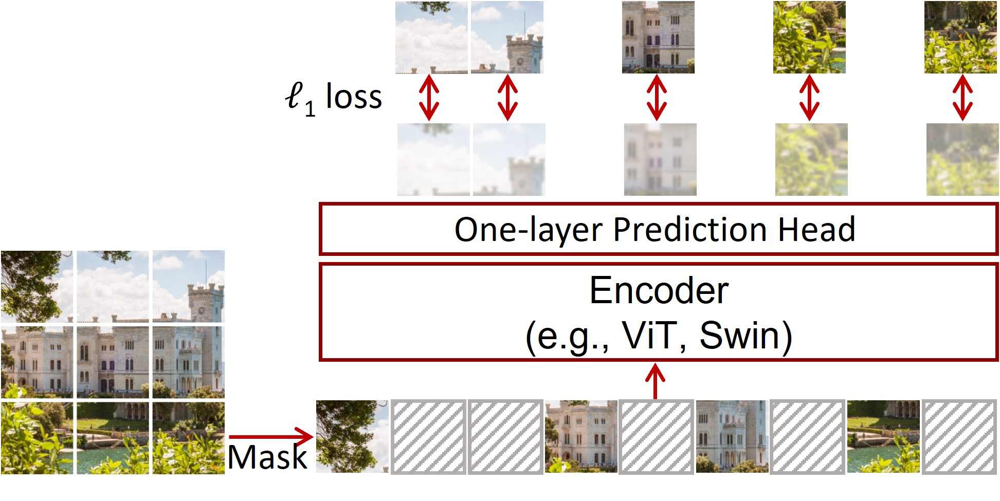

# SimMIM

By [Zhenda Xie](https://zdaxie.github.io)\*, [Zheng Zhang](https://stupidzz.github.io/)\*, [Yue Cao](http://yue-cao.me)\*, [Yutong Lin](https://github.com/impiga), [Jianmin Bao](https://jianminbao.github.io/), [Zhuliang Yao](https://github.com/Howal), [Qi Dai](https://www.microsoft.com/en-us/research/people/qid/) and [Han Hu](https://ancientmooner.github.io/)\*.

This repo is the official implementation of ["SimMIM: A Simple Framework for Masked Image Modeling"](https://arxiv.org/abs/2111.09886).

## Updates

***09/29/2022***

SimMIM was merged to [Swin Transformer repo on GitHub](https://github.com/microsoft/Swin-Transformer).

***03/02/2022***

SimMIM got accepted by CVPR 2022. SimMIM was used in ["Swin Transformer V2"](https://github.com/microsoft/Swin-Transformer) to alleviate the data hungry problem for large-scale vision model training.

***12/09/2021***

Initial commits:

1. Pre-trained and fine-tuned models on ImageNet-1K (`Swin Base`, `Swin Large`, and `ViT Base`) are provided.
2. The supported code for ImageNet-1K pre-training and fine-tuneing is provided.

## Introduction

**SimMIM** is initially described in [arxiv](https://arxiv.org/abs/2111.09886), which serves as a
simple framework for masked image modeling. From systematically study, we find that simple designs of each component have revealed very strong representation learning performance: 1) random masking of the input image with a moderately large masked patch size (e.g., 32) makes a strong pre-text task; 2) predicting raw pixels of RGB values by direct regression performs no worse than the patch classification approaches with complex designs; 3) the prediction head can be as light as a linear layer, with no worse performance than heavier ones.

<div align="center">
    
</div>

## Main Results on ImageNet

### Swin Transformer

**ImageNet-1K Pre-trained and Fine-tuned Models**

| name | pre-train epochs | pre-train resolution | fine-tune resolution | acc@1 | pre-trained model | fine-tuned model |
| :---: | :---: | :---: | :---: | :---: | :---: | :---: |
| Swin-Base | 100 | 192x192 | 192x192 | 82.8 | [google](https://drive.google.com/file/d/1Wcbr66JL26FF30Kip9fZa_0lXrDAKP-d/view?usp=sharing)/[config](configs/swin_base__100ep/simmim_pretrain__swin_base__img192_window6__100ep.yaml) | [google](https://drive.google.com/file/d/1RsgHfjB4B1ZYblXEQVT-FPX3WSvBrxcs/view?usp=sharing)/[config](configs/swin_base__100ep/simmim_finetune__swin_base__img192_window6__100ep.yaml) |
| Swin-Base | 100 | 192x192 | 224x224 | 83.5 | [google](https://drive.google.com/file/d/1Wcbr66JL26FF30Kip9fZa_0lXrDAKP-d/view?usp=sharing)/[config](configs/swin_base__100ep/simmim_pretrain__swin_base__img192_window6__100ep.yaml) | [google](https://drive.google.com/file/d/1mb43BkW56F5smwiX-g7QUUD7f1Rftq8u/view?usp=sharing)/[config](configs/swin_base__100ep/simmim_finetune__swin_base__img224_window7__100ep.yaml) |
| Swin-Base | 800 | 192x192 | 224x224 | 84.0 | [google](https://drive.google.com/file/d/15zENvGjHlM71uKQ3d2FbljWPubtrPtjl/view?usp=sharing)/[config](configs/swin_base__800ep/simmim_pretrain__swin_base__img192_window6__800ep.yaml) | [google](https://drive.google.com/file/d/1xEKyfMTsdh6TfnYhk5vbw0Yz7a-viZ0w/view?usp=sharing)/[config](configs/swin_base__800ep/simmim_finetune__swin_base__img224_window7__800ep.yaml) |
| Swin-Large | 800 | 192x192 | 224x224 | 85.4 | [google](https://drive.google.com/file/d/1qDxrTl2YUDB0505_4QrU5LU2R1kKmcBP/view?usp=sharing)/[config](configs/swin_large__800ep/simmim_pretrain__swin_large__img192_window12__800ep.yaml) | [google](https://drive.google.com/file/d/1mf0ZpXttEvFsH87Www4oQ-t8Kwr0x485/view?usp=sharing)/[config](configs/swin_large__800ep/simmim_finetune__swin_large__img224_window14__800ep.yaml) |
| SwinV2-Huge | 800 | 192x192 | 224x224 | 85.7 | / | / |
| SwinV2-Huge | 800 | 192x192 | 512x512 | 87.1 | / | / |

### Vision Transformer

**ImageNet-1K Pre-trained and Fine-tuned Models**

| name | pre-train epochs | pre-train resolution | fine-tune resolution | acc@1 | pre-trained model | fine-tuned model |
| :---: | :---: | :---: | :---: | :---: | :---: | :---: |
| ViT-Base | 800 | 224x224 | 224x224 | 83.8 | [google](https://drive.google.com/file/d/1dJn6GYkwMIcoP3zqOEyW1_iQfpBi8UOw/view?usp=sharing)/[config](configs/vit_base__800ep/simmim_pretrain__vit_base__img224__800ep.yaml) | [google](https://drive.google.com/file/d/1fKgDYd0tRgyHyTnyB1CleYxjo0Gn5tEB/view?usp=sharing)/[config](configs/vit_base__800ep/simmim_finetune__vit_base__img224__800ep.yaml) |

## Citing SimMIM

```
@inproceedings{xie2021simmim,
  title={SimMIM: A Simple Framework for Masked Image Modeling},
  author={Xie, Zhenda and Zhang, Zheng and Cao, Yue and Lin, Yutong and Bao, Jianmin and Yao, Zhuliang and Dai, Qi and Hu, Han},
  booktitle={International Conference on Computer Vision and Pattern Recognition (CVPR)},
  year={2022}
}
```

## Getting Started

### Installation

- Install `CUDA 11.3` with `cuDNN 8` following the official installation guide of [CUDA](https://docs.nvidia.com/cuda/cuda-installation-guide-linux/index.html) and [cuDNN](https://developer.nvidia.com/rdp/cudnn-archive).

- Setup conda environment:
```bash
# Create environment
conda create -n SimMIM python=3.8 -y
conda activate SimMIM

# Install requirements
conda install pytorch torchvision torchaudio cudatoolkit=11.3 -c pytorch -y

# Install apex
git clone https://github.com/NVIDIA/apex
cd apex
pip install -v --disable-pip-version-check --no-cache-dir --global-option="--cpp_ext" --global-option="--cuda_ext" ./
cd ..

# Clone SimMIM
git clone https://github.com/microsoft/SimMIM
cd SimMIM

# Install other requirements
pip install -r requirements.txt
```

### Evaluating provided models

To evaluate a provided model on ImageNet validation set, run:
```bash
python -m torch.distributed.launch --nproc_per_node <num-of-gpus-to-use> main_finetune.py \
--eval --cfg <config-file> --resume <checkpoint> --data-path <imagenet-path>
```

For example, to evaluate the `Swin Base` model on a single GPU, run:
```bash
python -m torch.distributed.launch --nproc_per_node 1 main_finetune.py \
--eval --cfg configs/swin_base__800ep/simmim_finetune__swin_base__img224_window7__800ep.yaml --resume simmim_finetune__swin_base__img224_window7__800ep.pth --data-path <imagenet-path>
```

### Pre-training with SimMIM
To pre-train models with `SimMIM`, run:
```bash
python -m torch.distributed.launch --nproc_per_node <num-of-gpus-to-use> main_simmim.py \ 
--cfg <config-file> --data-path <imagenet-path>/train [--batch-size <batch-size-per-gpu> --output <output-directory> --tag <job-tag>]
```

For example, to pre-train `Swin Base` for 800 epochs on one DGX-2 server, run:
```bash
python -m torch.distributed.launch --nproc_per_node 16 main_simmim.py \ 
--cfg configs/swin_base__800ep/simmim_pretrain__swin_base__img192_window6__800ep.yaml --batch-size 128 --data-path <imagenet-path>/train [--output <output-directory> --tag <job-tag>]
```

### Fine-tuning pre-trained models
To fine-tune models pre-trained by `SimMIM`, run:
```bash
python -m torch.distributed.launch --nproc_per_node <num-of-gpus-to-use> main_finetune.py \ 
--cfg <config-file> --data-path <imagenet-path> --pretrained <pretrained-ckpt> [--batch-size <batch-size-per-gpu> --output <output-directory> --tag <job-tag>]
```

For example, to fine-tune `Swin Base` pre-trained by `SimMIM` on one DGX-2 server, run:
```bash
python -m torch.distributed.launch --nproc_per_node 16 main_finetune.py \ 
--cfg configs/swin_base__800ep/simmim_finetune__swin_base__img224_window7__800ep.yaml --batch-size 128 --data-path <imagenet-path> --pretrained <pretrained-ckpt> [--output <output-directory> --tag <job-tag>]
```

## Contributing

This project welcomes contributions and suggestions.  Most contributions require you to agree to a
Contributor License Agreement (CLA) declaring that you have the right to, and actually do, grant us
the rights to use your contribution. For details, visit https://cla.opensource.microsoft.com.

When you submit a pull request, a CLA bot will automatically determine whether you need to provide
a CLA and decorate the PR appropriately (e.g., status check, comment). Simply follow the instructions
provided by the bot. You will only need to do this once across all repos using our CLA.

This project has adopted the [Microsoft Open Source Code of Conduct](https://opensource.microsoft.com/codeofconduct/).
For more information see the [Code of Conduct FAQ](https://opensource.microsoft.com/codeofconduct/faq/) or
contact [opencode@microsoft.com](mailto:opencode@microsoft.com) with any additional questions or comments.

## Trademarks

This project may contain trademarks or logos for projects, products, or services. Authorized use of Microsoft 
trademarks or logos is subject to and must follow 
[Microsoft's Trademark & Brand Guidelines](https://www.microsoft.com/en-us/legal/intellectualproperty/trademarks/usage/general).
Use of Microsoft trademarks or logos in modified versions of this project must not cause confusion or imply Microsoft sponsorship.
Any use of third-party trademarks or logos are subject to those third-party's policies.
